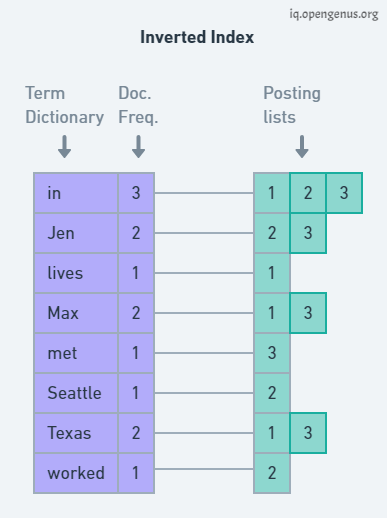

#information retrieval

**In this project, there are two steps to return names of 10 highest similarity books with query.**

**Firstly**, download the dataset from _https://github.com/mohamad-dehghani/persian-pdf-books-dataset_ and,
this dataset contains information on Persian pdf books. Furthermore, the dataset consists of information
about 2428 books with six features namely title, date, content, category, author, and comments, but actually
I just use title and content of books in this project and, this step includes two phases namely Pre-processing and 
Inverted indexing.
In the pre-processing phase, methods such as normalization, removal of stop words, stemming, and lemmatization applies
to the book's content feature, which is reasonable and necessary from my point of view, and stores it. In the Inverted indexing
phase, I should invert indexing the final token extracted from the pre-processing phase for each book like the below image.

**Secondly**, I write ten queries related to the book's content feature manually then apply Pre-processing phase to these queries and,
I append queries to the dataset's content feature to create a vector with one dimension (2438 * 1) and then calculate the tf-idf score for
each word in vector and for each record. after obtaining the vector representation tf-idf, return names of 10 books that 
has the highest cosine similarity with desired query (I calculate the cosine similarity of each query and all books' content).
To sum up, I return names of 10 highest similar books with each of the queries 

